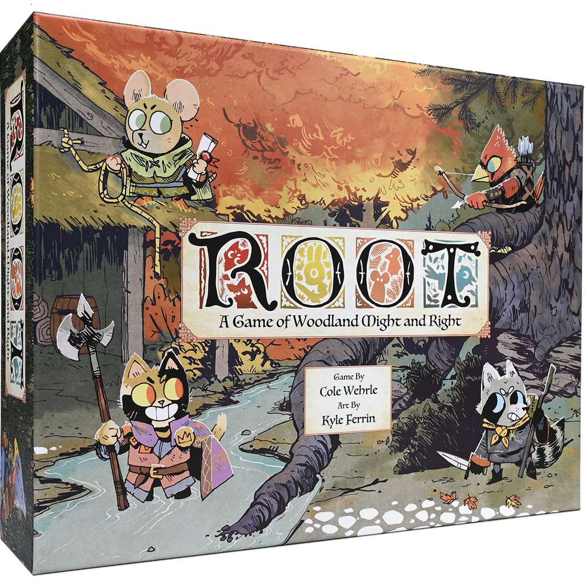

# Simulating Root Combat

In the game [Root](https://ledergames.com/products/root-a-game-of-woodland-might-and-right), different vactions vie for control of the woodland. When two factions battle in a clearing, two dice (each with the numbers 0-3) are rolled with the attacker claiming the larger number and the defender getting the smaller number. 

The details of combat are spelled out [here](http://root.livingrules.io/) in section **4.3.2.i**

The function `sim_combat` in `main.py` accepts 3 arguments: `attackers`, the number of attackers in a clearing, `defenders`, the number of defenders, and `n`, the number of times to simulate the combat.

In a somewhat crude measurement of the combat's outcome, let's say the attacker gains a point for every defending unit they destroy and lose a point for every unit they lose. We call the **expected value** of a combat the net gain/loss the attacker would expect to have *on average*.

## Example:
Consider the simple example of a clearing with one attacking unit and one defending unit. Since there is only one of each unit, the maximum number of hits each side can deal is 1. There are three possibile outcomes of this combat: both sides deal a hit, the attacker deals a hit and the defender doesn't, or neither side scores a hit. Because this example is so straightforward, we can calculate the expectation value by hand by assigning a probability to each outcome and then calculating the weighted average.

## The Math:
**Neither side scores a hit:** This can only happen one way - if both dice roll 0. The probability of rolling this is 1/16. We neither win nor lose the combat, so we neither gain nor lose points, resulting in a score of 0.

**Attacker hits, defender misses:** This happens when only one, *not both* dice are 0. We can expect this to happen 6/16 of the time (why?). The attacker gains a point for a net score of 1.

**Both sides hit**: This happens the remainder of the time, in other words with a probability of 9/16. The attacker removes a defending unit but also loses one of their own, for a net score of 0.

**Calculating the EV:** We score 0 points 10/16 of the time, and 1 point 6/16 of the time. This results in an EV of 6/16, or ~.375 units. In other words, we can expect to gain a 1 unit advantage over our opponent a little less than every three battles in these conditions.

Test your function by ensuring that `sim_combat(1, 1, 1000)` yields a result close to .375!

